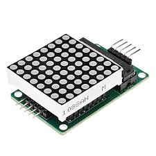
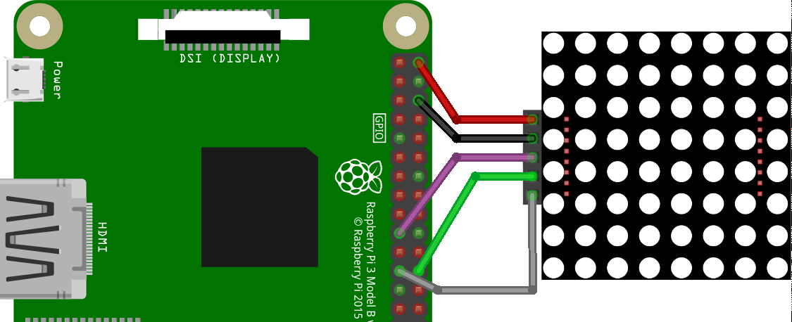

## Raspberry Pi 3 - 8x8 LED Matrix



Pi3 GPIO腳位見下圖：


電路圖如下圖：



```sh
$ sudo apt-get install python-dev python-pip
$ sudo pip install spidev
```

```sh
$ git clone https://github.com/coding-world/max7219
$ cd max7219
$ sudo python setup.py install
```

```sh
$ sudo raspi-config

Use the down arrow to select 5 Interfacing Options.
Arrow down to A4 SPI.
Select yes when it asks you to enable SPI.
```

運行程序：

```sh
$ sudo python examples/matrix_test.py
```
