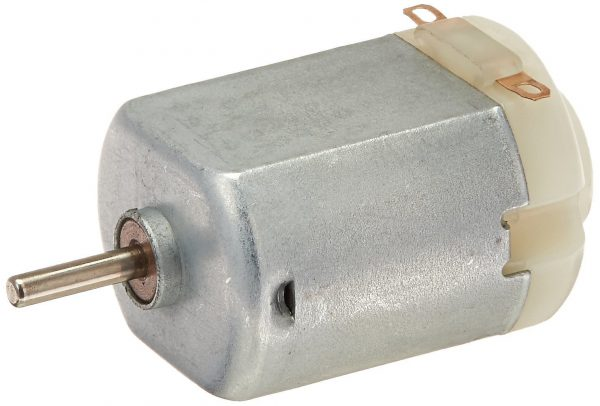
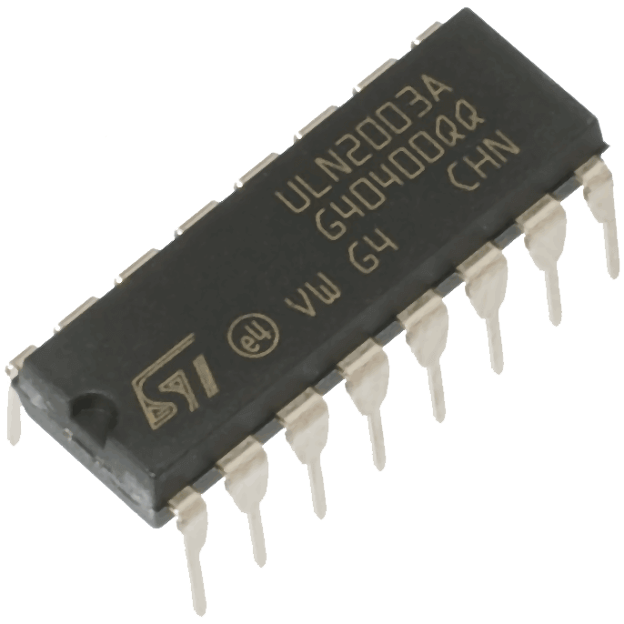
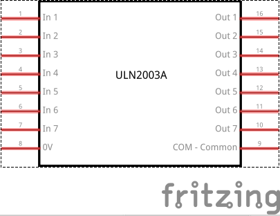
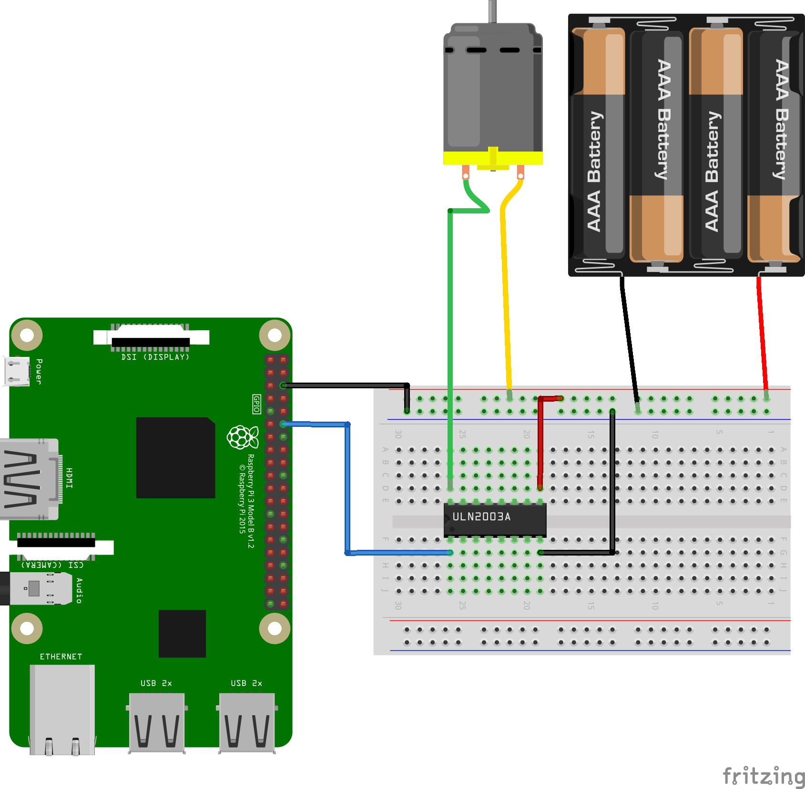

## Raspberry Pi 3 - DC motor with ULN2003A



Pi3 GPIO腳位見下圖：


所需的元件如下圖：





線路圖如下圖：



Run:

```sh
$ python dc_motor_transistor.py
```

參考文章：

[Raspberry Pi 3 Model B 利用 ULN2003A 驅動直流馬達](https://blog.everlearn.tw/%E7%95%B6-python-%E9%81%87%E4%B8%8A-raspberry-pi/raspberry-pi-3-model-b-%E5%88%A9%E7%94%A8-uln2003a-%E9%A9%85%E5%8B%95%E7%9B%B4%E6%B5%81%E9%A6%AC%E9%81%94)
