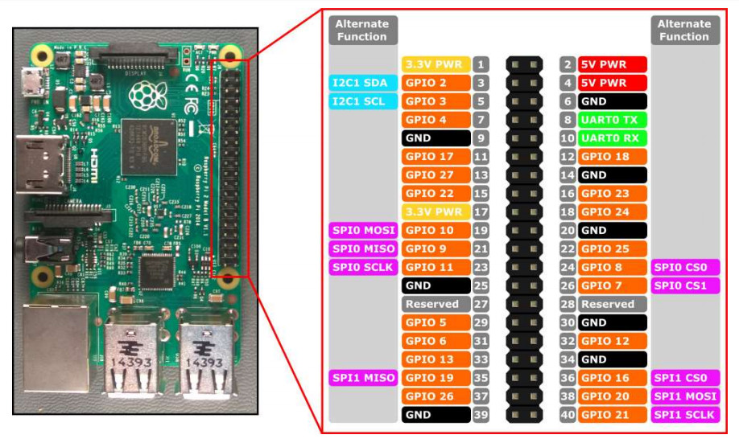

## Raspberry Pi 3 - Led

Pi3 GPIO腳位見下圖：



PWM控制LED燈泡電路圖：


Run:

```sh
$ python pwm_led.py
```


參考文章：

[在 Raspberry Pi 3 Model B 利用 PWM 控制 LED 亮度](https://blog.everlearn.tw/%E7%95%B6-python-%E9%81%87%E4%B8%8A-raspberry-pi/%E5%9C%A8-raspberry-pi-3-model-b-%E5%88%A9%E7%94%A8-pwm-%E6%8E%A7%E5%88%B6-led-%E4%BA%AE%E5%BA%A6)
