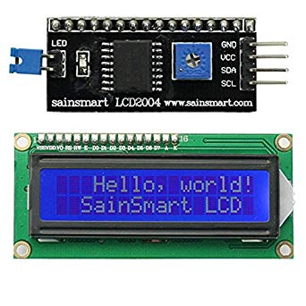

## Raspberry Pi 3 - SainSmart 1602 LCD

Pi3 GPIO腳位見下圖：


所需的組件見下圖:



| 2x16LCD | Raspberry Pi |
| ------- |:------------:|
| Vcc     | pin 2        |
| Gnd     | pin 6        |
| SDA     | pin 3        |
| SCL     | pin 5        |

先把I2C接口enable了，默認是disable。

```
# sudo raspi-config

Select "5 Interfacing Options"
Select "P5 I2C"

然後reboot pi3
# reboot
```


下載Python驅動程式

```
# git clone https://github.com/paulbarber/raspi-gpio
# cd raspi-gpio
# vim lcd_display.py
```

修改ADDRESS為0x27

```py
import i2c_lib
from time import sleep

# LCD Address
ADDRESS = 0x27
```

在rasi-gpio目錄下新增以下python文件，假設文件名為show.py

```py
from lcd_display import lcd

my_lcd = lcd()
my_lcd.display_string("Raspberry Pi", 1)
my_lcd.display_string("Hello", 2)
```

然後運行show.py文件，lcd就會顯示內容

```
python show.py
```

參考文章：

[Raspberry使用i2c控制2x16LCD](https://sites.google.com/site/zsgititit/home/raspberry-shu-mei-pai/raspberry-shi-yongi2c-kong-zhi2x16lcd)
