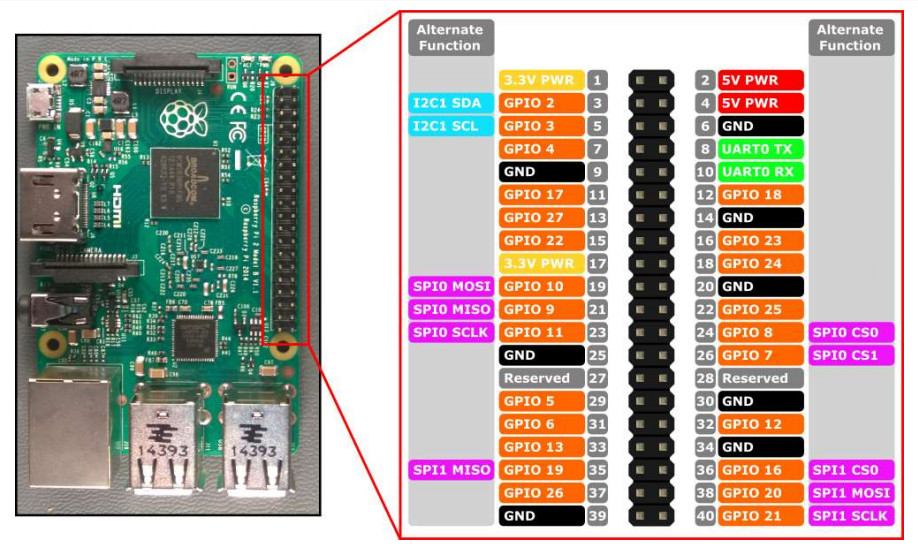
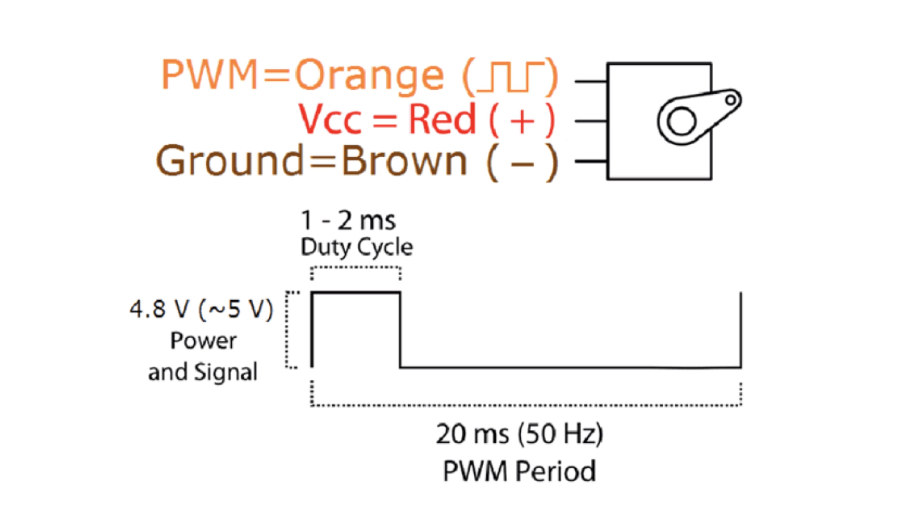

## Raspberry Pi 3 - Servo SG90

Pi3 GPIO腳位見下圖：



Tower Pro SG90見下圖：


需要接的三根線如下圖（在這個例子中，我把PWM接到PI3的GPIO 17腳位中）：



Run:

```sh
$ python pwm_servo.py
```

參考文章：

[Raspberry Pi 3 - GPIO-PWM-Servo-Using SG90](https://www.jianshu.com/p/54ec419832a1)
