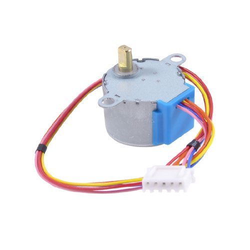
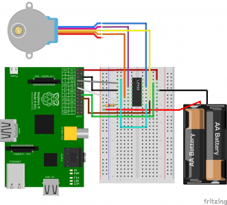

## Raspberry Pi 3 - Stepper Motor Control with ULN2003A

Pi3 GPIO腳位見下圖：



電路圖如下圖：



運行如下：

```sh
$ python stepper.py
Time Delay (ms)? 1
How many steps forward? 100
How many steps backwards? 512
```

參考文章：

[Raspberry Pi Stepper Motor Control with L293D / ULN2003A](https://tutorials-raspberrypi.com/how-to-control-a-stepper-motor-with-raspberry-pi-and-l293d-uln2003a/)
